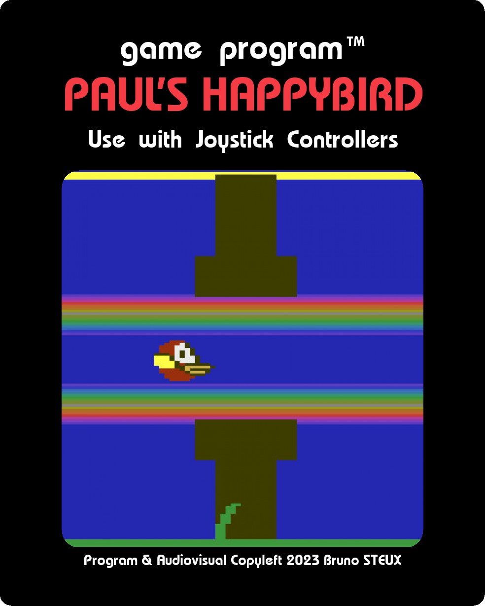

  

# Paul's HappyBird. A colorful game for the Atari 2600.

Paul's HeppyBird has been written in C using cc2600. 
It's a 16KB ROM (classical ATARI bankswitching scheme) that has been
tested on Harmony cart and PlusCart (but in PAL version only). 

HappyBird implements :

- 60Hz NTSC and a 50Hz PAL/SECAM versions (SECAM friendly)

- Highscore save on SaveKey (high score reset by pulling the Settings switch for 5 seconds)

- Amateur and Pro modes

- Pause with the Color/BW switch 

- Reach 100, 200, 300, etc and some colorful animations will start

- PlusROM High Score Club compatible !

Technically, it's using an assymetric playfield scrolling with a big main sprite with 3 colors
on the same line (using all available sprites + the ball).

# How to build it :

With cc2600 installed :

`cc2600 bird.c -DPLUSROM` to build the NTSC version with PlusROM support

`cc2600 bird.c -DPAL -DPLUSROM` to build the PAL/SECAM version with PlusROM support

This will produce `out.a`, which is a DASM compatible source code.

Type `dasm out.a -f3 -v4 -oout.bin -lout.lst -sout.sym` to make the cartridge.

# How to play it :

You can run freely this game on Harmony cart or PlusCart, and most likely on any cart able to run F6 bankswitching scheme
carts.

This ROM doesn't work directly with the Stella emulator, due to false autodetection of paddle inputs. Run stella with :
`stella -lc Joystick happybird.bin`

# TODO

- [ ] add AtariVox sounds when I'll have received mine... This will be the "Deluxe" version
